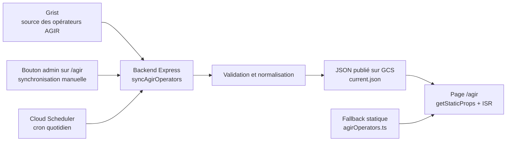

# Synchronisation des opérateurs AGIR depuis Grist

## Objectif

La page `/agir` affiche les coordonnées des opérateurs AGIR par département.

Avant cette évolution, ces coordonnées étaient maintenues dans le code :

```txt
apps/client/src/data/agirOperators.ts
```

Le nouveau fonctionnement permet à l’équipe de mettre à jour ces coordonnées dans Grist, puis de publier une version JSON utilisée par Réfugiés.info, sans redéployer le site.

La synchronisation depuis Grist peut se faire de deux façons :

- **manuellement**, via un bouton réservé aux admins sur la page `/agir` ;
- **automatiquement**, via un cron quotidien configuré dans Cloud Scheduler.

Dans les deux cas, Grist reste la source de données : Réfugiés.info relit toute la table, vérifie les données, puis republie un JSON complet.

Le fichier statique historique reste conservé comme fallback ultime : si le JSON publié est indisponible ou invalide, `/agir` continue de fonctionner avec les données embarquées dans le code.

---

## Vue d’ensemble



Deux déclencheurs utilisent le même workflow backend :

1. **Synchronisation manuelle** depuis l’encart admin sur `/agir`.
2. **Synchronisation automatique** via Cloud Scheduler.

Dans les deux cas, le backend relit toute la table Grist, valide les données, puis publie un JSON complet sur Google Cloud Storage.

---

## Parcours fonctionnel

### Mise à jour manuelle

1. L’équipe modifie les coordonnées dans Grist.
2. Un admin ouvre `/agir` en étant connecté.
3. L’encart admin affiche le bouton de synchronisation.
4. L’admin clique sur **Synchroniser les opérateurs AGIR depuis Grist**.
5. Le backend relit toute la table Grist.
6. Si les données sont valides, le backend publie un nouveau JSON.
7. La page `/agir` utilise la nouvelle donnée publiée.

La synchronisation est volontaire : l’équipe peut faire plusieurs modifications dans Grist, puis publier une seule fois quand tout est prêt.

### Synchronisation automatique

Un job Cloud Scheduler appelle régulièrement la route cron du backend. Il sert de filet de sécurité pour limiter les oublis de synchronisation manuelle.

La configuration Cloud Scheduler peut être modifiée ici :

https://console.cloud.google.com/cloudscheduler?hl=fr&project=refugies-info

---

## Données Grist utilisées

La table Grist contient une ligne par département.

| Colonne Grist | Usage dans Réfugiés.info | Obligatoire |
|---|---|---|
| `Departement` | clé département + libellé affiché | Oui |
| `Operateur` | nom de l’opérateur affiché sur `/agir` | Oui |
| `Mail_generique` | email affiché si valide | Non |
| `Telephone` | téléphone affiché si renseigné | Non |
| `Fiche_RI` | lien vers une fiche RI si un ObjectId valide est trouvé | Non |

Les autres colonnes Grist ne sont pas utilisées par ce premier lot.

---

## Validation et normalisation

La synchronisation publie toujours un état complet de la table, pas une ligne isolée.

### Normalisations appliquées

- `trim()` sur les chaînes de caractères.
- Extraction du code département depuis `Departement`.
- Support des codes de Corse `2A` et `2B`.
- Extraction d’un ObjectId depuis `Fiche_RI`.
- Validation simple de l’email après nettoyage.

### Erreurs bloquantes

Si une erreur bloquante est détectée, le backend ne publie pas de nouveau `current.json`.

Exemples :

- Grist indisponible ;
- erreur HTTP Grist ;
- réponse Grist illisible ;
- champ `records` absent ou non-array ;
- département absent ou mal formé ;
- doublon de département ;
- opérateur vide ;
- aucune ligne valide.

Dans ce cas, l’ancien JSON publié reste disponible.

### Warnings non bloquants

Certains problèmes ne bloquent pas la publication :

- valeur nettoyée par `trim()` ;
- email invalide : l’email est ignoré ;
- lien fiche RI invalide : le bouton vers la fiche n’est pas affiché.

Les warnings sont renvoyés à l’admin et conservés dans le fichier de vérification `_checks`, mais ne sont pas exposés dans le JSON public `current.json`.

---

## JSON publié sur Google Cloud Storage

### Bucket

Les données sont publiées dans le bucket existant :

```txt
refugies-info-assets
```

Objet public utilisé par `/agir` :

```txt
gs://refugies-info-assets/agir/operators/current.json
https://storage.googleapis.com/refugies-info-assets/agir/operators/current.json
```

Staging et production partagent volontairement le même objet JSON AGIR.

### Format de `current.json`

```json
{
  "generatedAt": "2026-07-01T11:00:22.681Z",
  "source": "grist",
  "status": "published",
  "recordCount": 94,
  "departmentCount": 94,
  "operatorsPerDepartment": {
    "00": {
      "department": "00 - Département exemple",
      "operator": "Opérateur exemple",
      "email": "contact@example.org",
      "phone": "01 23 45 67 89",
      "dispositifId": "000000000000000000000000"
    }
  }
}
```

`current.json` est remplacé uniquement après validation complète des données Grist.

### Fichiers de vérification `_checks`

Chaque synchronisation réussie écrit aussi un fichier horodaté :

```txt
agir/operators/_checks/sync-check-<timestamp>.json
```

Ce fichier contient le même payload que `current.json`, plus les warnings détectés pendant la normalisation.

Il sert de trace de contrôle pour vérifier ce qui a été importé et quels champs ont été nettoyés ou ignorés.

---

## Lecture côté `/agir`

La page `/agir` lit le JSON GCS côté `getStaticProps`.

Fonctionnement :

1. Next.js tente de lire `current.json` depuis l’URL publique GCS.
2. Le JSON est validé rapidement : `operatorsPerDepartment` doit être un objet exploitable.
3. Si la lecture ou la validation échoue, la page utilise le fallback statique `apps/client/src/data/agirOperators.ts`.
4. La page est régénérée avec `revalidate: 60`.

Après une synchronisation manuelle, l’état local de la page est mis à jour avec la réponse API pour permettre à l’admin de vérifier immédiatement les nouvelles coordonnées, sans attendre la prochaine revalidation ISR.

### Délai de mise à jour après le cron

Quand le cron tourne, le backend met à jour le fichier GCS `current.json` immédiatement.

La page `/agir`, elle, est servie par Next.js en génération statique avec revalidation (`ISR`) toutes les 60 secondes :

- le JSON GCS est à jour tout de suite après le cron ;
- la page `/agir` se met à jour lors d’une prochaine requête après expiration du délai de revalidation ;
- en pratique, les nouvelles données apparaissent généralement dans la minute ou les quelques minutes qui suivent ;
- pendant ce délai, certains visiteurs peuvent encore voir l’ancienne version de la page ;
- ce délai ne bloque pas la disponibilité : la page continue d’afficher soit la dernière version publiée, soit le fallback statique en cas de problème.

La synchronisation manuelle via le bouton admin met aussi à jour l’état local de la page immédiatement pour l’admin qui déclenche la publication. Le délai ISR concerne surtout les visiteurs publics et les autres instances frontend après une synchronisation automatique.

Helper concerné :

```txt
apps/client/src/lib/agirOperators.ts
```

---

## Routes backend

### Synchronisation manuelle admin

```txt
POST /agir/operators/sync
```

Sécurité :

```ts
@Security({
  jwt: ["admin"],
  fromSite: [],
})
```

Cette route est appelée par le bouton admin sur `/agir`.

### Synchronisation automatique cron

```txt
POST /agir/operators/sync/cron
```

Sécurité :

```ts
@Security({ fromCron: [] })
```

Cette route est appelée par Cloud Scheduler.

Les deux routes utilisent le même workflow :

```txt
syncAgirOperators()
```

---

## Réponse de synchronisation

Les routes de synchronisation renvoient une réponse de ce type :

```json
{
  "text": "success",
  "data": {
    "success": true,
    "source": "grist",
    "status": "published",
    "message": "Les opérateurs AGIR ont bien été publiés depuis Grist",
    "recordCount": 94,
    "departmentCount": 94,
    "operatorsPerDepartment": {
      "00": {
        "department": "00 - Département exemple",
        "operator": "Opérateur exemple",
        "email": "contact@example.org",
        "phone": "01 23 45 67 89",
        "dispositifId": "000000000000000000000000"
      }
    },
    "gcsCheckObjectName": "agir/operators/_checks/sync-check-2026-07-01T11-00-22-681Z.json",
    "gcsCurrentObjectName": "agir/operators/current.json",
    "warnings": []
  }
}
```

En cas d’échec, l’API renvoie une erreur HTTP. Le précédent `current.json` reste publié.

---

## Variables d’environnement

### `GRIST_AGIR_API_URL`

URL complète de l’endpoint Grist qui renvoie les records des opérateurs AGIR.

Utilisée par le backend pendant la synchronisation.

Si cette variable est absente, la synchronisation échoue avec une erreur serveur.

### `GRIST_AGIR_API_KEY`

Clé API utilisée pour lire la table Grist.

Elle est envoyée dans le header :

```txt
Authorization: Bearer <GRIST_AGIR_API_KEY>
```

Elle ne doit jamais être exposée côté client.

### `AGIR_OPERATORS_GCS_BUCKET`

Nom du bucket GCS dans lequel les JSON AGIR sont publiés.

Valeur retenue :

```txt
refugies-info-assets
```

Le service account utilisé par le backend doit avoir les droits d’écriture nécessaires sur ce bucket.

### `AGIR_OPERATORS_GCS_OBJECT`

Chemin de l’objet JSON stable lu par `/agir`.

Valeur retenue :

```txt
agir/operators/current.json
```

Ce chemin sert aussi à construire les fichiers de vérification :

```txt
agir/operators/_checks/sync-check-<timestamp>.json
```

### Variables Google Cloud utilisées pour l’écriture GCS

L’écriture GCS réutilise les credentials Google Cloud du backend :

```txt
GCLOUD_CLIENT_EMAIL
GCLOUD_PKEY
GCLOUD_PRIVATE_KEY_ID
```

But : authentifier le service account qui écrit dans le bucket GCS.

Selon les usages Google existants, `GCLOUD_PKEY` contient la clé privée avec les retours ligne échappés (`\n`), qui sont restaurés au runtime.

Ces trois variables sont celles utilisées directement par le helper d’upload AGIR vers GCS.

### `CRON_TOKEN`

Secret applicatif utilisé par la route cron :

```txt
POST /agir/operators/sync/cron
```

Cloud Scheduler doit l’envoyer dans le body JSON :

```json
{"query":{"cronToken":"<CRON_TOKEN>"}}
```

---

## Configuration Cloud Scheduler

La récurrence du cron peut être modifiée dans Google Cloud Console :

https://console.cloud.google.com/cloudscheduler?hl=fr&project=refugies-info

Configuration retenue :

```txt
Nom : syncAgirOperatorsFromGrist
Région : europe-west1
Fréquence : 0 7 * * 1-5
Fuseau horaire : Europe/Paris
Type de cible : HTTP
Méthode HTTP : POST
URL : https://api.refugies.info/agir/operators/sync/cron
```

En-têtes HTTP :

```txt
Content-Type: application/json
User-Agent: Google-Cloud-Scheduler
```

Body :

```json
{"query":{"cronToken":"<CRON_TOKEN>"}}
```

Authentification Cloud Scheduler :

```txt
Aucune
```

Le backend n’utilise pas de jeton OIDC pour cette route. L’authentification repose sur le `cronToken` applicatif transmis dans le body JSON.

Configuration des nouvelles tentatives :

- `0` retry est acceptable pour une configuration simple ;
- `1` à `2` retries peuvent être ajoutés pour couvrir un échec temporaire Grist ou GCS ;
- en cas d’échec complet, le dernier `current.json` valide reste publié.

---

## Observabilité et vérifications

### Logs backend

Logs utiles côté backend :

```txt
[agirOperators] JSON uploaded to GCS
[agirOperators] Grist records fetched
[agirOperators] Grist records normalized with warnings
[agirOperators] Grist fetch failed
```

### Logs de lecture `/agir`

Si la page ne parvient pas à lire le JSON GCS, elle loggue :

```txt
[agirOperators] Failed to fetch GCS JSON
[agirOperators] Invalid GCS JSON format
[agirOperators] Error while fetching GCS JSON
```

Dans tous ces cas, le fallback statique est utilisé.

### Vérification manuelle

Après une synchronisation réussie :

1. vérifier qu’un nouveau fichier est présent dans :
   ```txt
   gs://refugies-info-assets/agir/operators/_checks/
   ```
2. vérifier que `current.json` répond en HTTP 200 :
   ```txt
   https://storage.googleapis.com/refugies-info-assets/agir/operators/current.json
   ```
3. ouvrir `/agir` et contrôler un département modifié.
