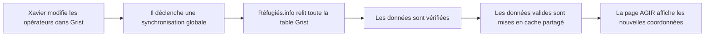
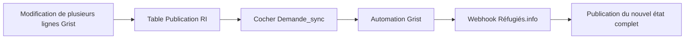

# Synchronisation des opérateurs AGIR depuis Grist

## Objectif

Les coordonnées des opérateurs AGIR sont préparées dans Grist, puis publiées vers Réfugiés.info via une synchronisation manuelle.

Le but est de permettre à l’équipe de corriger les coordonnées sans redéployer le site, tout en évitant une mise à jour automatique à chaque modification de ligne.

## Principe général

La synchronisation est volontaire : Xavier peut faire plusieurs modifications dans Grist, puis publier une seule fois quand tout est prêt.

## Comment Xavier déclenche une mise à jour

Une table de pilotage est prévue dans Grist, par exemple **Publication RI**.

Elle contient une ligne dédiée à la synchronisation AGIR :

| Champ | Rôle |
|---|---|
| `Nom` | “Synchronisation AGIR vers Réfugiés.info” |
| `Demande_sync` | case à cocher utilisée pour déclencher la publication |
| `Commentaire` | optionnel, pour noter le contexte d’une mise à jour |

Parcours côté Xavier :

1. Modifier les coordonnées dans la table principale Grist : opérateur, email, téléphone, lien vers une fiche RI si besoin.
2. Quand les modifications sont prêtes, aller dans la table **Publication RI**.
3. Cocher **Demande_sync**.
4. Grist déclenche une automation qui appelle Réfugiés.info.
5. Réfugiés.info relit toute la table Grist, vérifie les données, puis publie la nouvelle version si elle est valide.
6. Pour le premier lot, remettre manuellement **Demande_sync** à zéro après usage, afin de pouvoir relancer une future synchronisation.

## Ce qui est publié

La synchronisation publie un état complet de la table, pas une ligne isolée.

Champs utilisés sur la page AGIR :

| Champ Grist | Affichage Réfugiés.info |
|---|---|
| `Departement` | département sélectionnable |
| `Operateur` | nom de l’opérateur |
| `Mail_generique` | email affiché si valide |
| `Telephone` | téléphone |
| `Fiche_RI` | bouton “Découvrir la fiche” si le lien est valide |

Les adresses, régions, années et mails secondaires ne sont pas affichés dans ce premier lot.

## Que se passe-t-il en cas d’erreur ?

Si la synchronisation échoue, Réfugiés.info garde les dernières données valides.

Exemples d’erreurs bloquantes :

- Grist indisponible ;
- département manquant ;
- doublon de département ;
- opérateur vide ;
- réponse Grist illisible.

Exemples d’erreurs non bloquantes :

- email avec espace ou retour ligne : il est nettoyé ;
- email invalide : il n’est pas affiché ;
- lien fiche RI invalide : le bouton “Découvrir la fiche” n’est pas affiché.

Les visiteurs de la page AGIR ne voient pas d’erreur : ils continuent à voir la dernière donnée disponible, ou le fichier de secours si le cache est vide.

## Comment tester

1. Modifier une coordonnée dans Grist.
2. Déclencher la synchronisation via **Publication RI**.
3. Ouvrir `/agir`.
4. Sélectionner le département modifié.
5. Vérifier que la coordonnée apparaît.
6. Vérifier qu’un lien fiche RI valide affiche toujours le bouton “Découvrir la fiche”.
7. Remettre **Demande_sync** à zéro dans Grist.

## Évolution prévue

Dans un second temps, Réfugiés.info pourra éventuellement écrire dans Grist pour :

- remettre automatiquement `Demande_sync` à zéro ;
- écrire la date de dernière synchronisation ;
- écrire le dernier message d’erreur.

Ce n’est pas nécessaire pour le premier lot.
