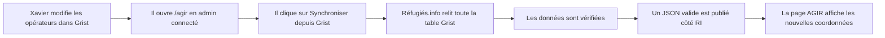
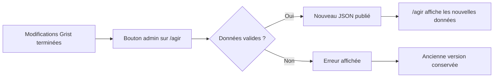
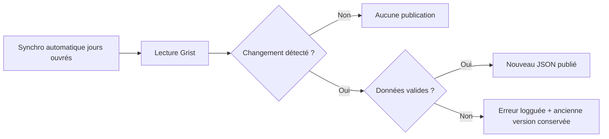

# Synchronisation des opérateurs AGIR depuis Grist

## Objectif

Les coordonnées des opérateurs AGIR sont préparées dans Grist, puis publiées vers Réfugiés.info via une action manuelle directement sur la page `/agir`, visible uniquement pour les admins connectés.

Le but est de permettre à l’équipe de corriger les coordonnées sans redéployer le site, tout en évitant une mise à jour automatique à chaque modification de ligne.

## Fonctionnement cible

La synchronisation est volontaire : Xavier peut faire plusieurs modifications dans Grist, puis publier une seule fois quand tout est prêt.

## Parcours Xavier

1. Modifier les coordonnées dans Grist : opérateur, email, téléphone, lien vers une fiche RI si besoin.
2. Ouvrir `/agir` avec un compte admin connecté.
3. Cliquer sur **Synchroniser les opérateurs AGIR depuis Grist** dans l’encart admin.
4. Lire le résultat affiché : succès, avertissements éventuels, ou erreur à corriger.
5. Vérifier directement sur `/agir` que le département modifié affiche la bonne donnée.

## Ce qui est publié

La synchronisation publie un état complet de la table Grist, pas une ligne isolée.

Champs utilisés sur la page AGIR :

| Champ Grist | Affichage Réfugiés.info |
|---|---|
| `Departement` | département sélectionnable |
| `Operateur` | nom de l’opérateur |
| `Mail_generique` | email affiché si valide |
| `Telephone` | téléphone |
| `Fiche_RI` | bouton “Découvrir la fiche” si le lien est valide |

Les adresses, régions, années et mails secondaires ne sont pas affichés dans ce premier lot.

## Gestion des erreurs

Si la synchronisation échoue, Réfugiés.info ne publie pas de nouveau JSON. La page AGIR continue donc d’utiliser la dernière version valide.

Erreurs bloquantes typiques :

- Grist indisponible ;
- département manquant ;
- doublon de département ;
- opérateur vide ;
- réponse Grist illisible.

Erreurs non bloquantes typiques :

- email avec espace ou retour ligne : il est nettoyé ;
- email invalide : il n’est pas affiché ;
- lien fiche RI invalide : le bouton “Découvrir la fiche” n’est pas affiché.

Les visiteurs de `/agir` ne voient pas d’erreur : ils continuent à voir la dernière donnée publiée, ou le fichier de secours si aucun JSON n’est disponible.

## Lot 2 envisagé : filet de sécurité automatique

Dans un second temps, une synchronisation automatique pourra tourner les jours ouvrés.

Elle ne remplace pas le bouton manuel : elle sert de filet de sécurité si une publication a été oubliée.

Principe prévu :

- Réfugiés.info lit Grist à intervalles réguliers ;
- les données sont normalisées ;
- si elles sont identiques à la version publiée, rien n’est changé ;
- si elles ont changé et sont valides, un nouveau JSON est publié ;
- si une erreur est détectée, l’ancienne version reste en place.

## Comment tester

1. Modifier une coordonnée dans Grist.
2. Ouvrir `/agir` avec un compte admin connecté.
3. Cliquer sur **Synchroniser les opérateurs AGIR depuis Grist**.
4. Vérifier le retour affiché dans l’encart admin.
5. Sélectionner le département modifié.
6. Vérifier que la coordonnée apparaît.
7. Vérifier qu’un lien fiche RI valide affiche toujours le bouton “Découvrir la fiche”.
