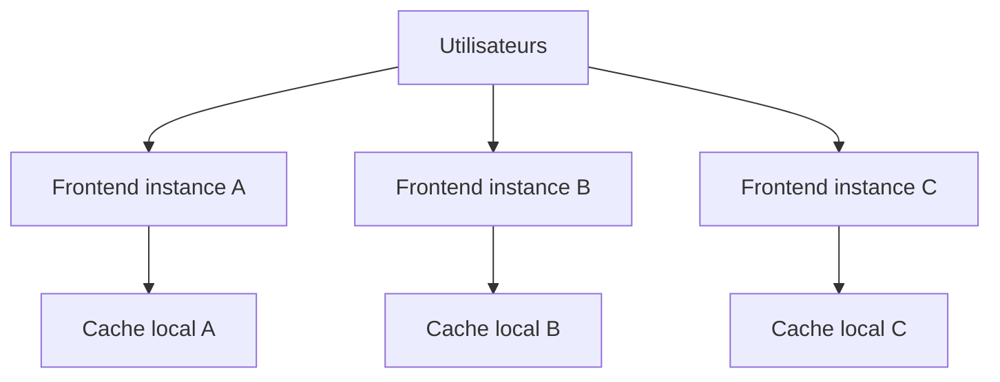
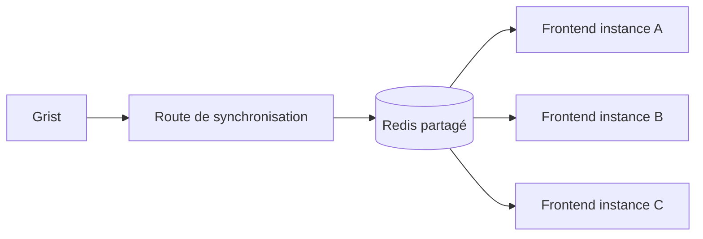
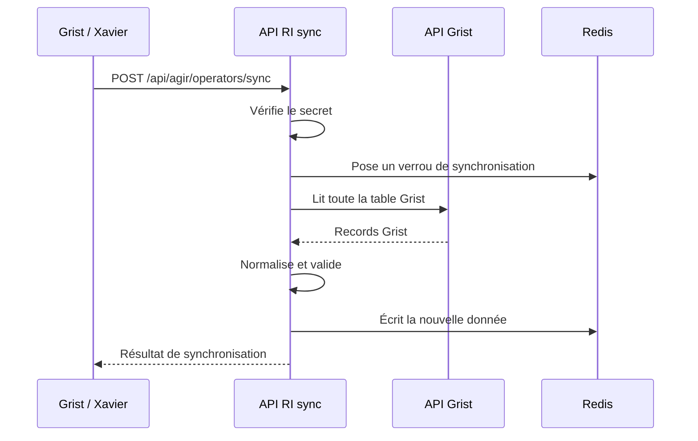
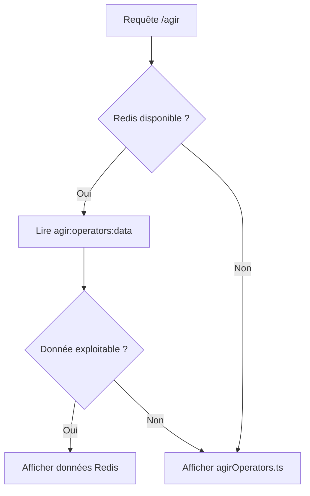
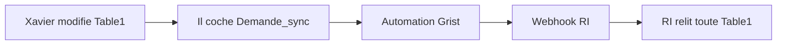

# Plan technique — données AGIR depuis Grist

## 1. Contexte

La page `/agir` utilise aujourd’hui un fichier statique :

```txt
apps/client/src/data/agirOperators.ts
```

Ce fichier alimente :

- la page AGIR ;
- le sélecteur de département ;
- la carte de France.

Objectif : utiliser Grist comme source principale, sans fragiliser la page publique.

## 2. Configuration

L’endpoint Grist exact ne doit pas être figé dans le code. Il est configuré par variables d’environnement :

```env
GRIST_API_URL=...
GRIST_API_KEY=...
GRIST_SYNC_SECRET=...
```

`GRIST_API_URL` pointe vers l’API Grist de lecture des records.

`GRIST_API_KEY` sert à lire la table Grist.

`GRIST_SYNC_SECRET` protège la route appelée par l’automation Grist.

## 3. Données Grist observées

La table contient actuellement :

- 94 lignes ;
- 94 départements distincts ;
- pas de doublon détecté.

Quelques emails contiennent des espaces ou retours ligne. Ces cas peuvent être corrigés automatiquement par `trim()`.

Champs retenus :

| Colonne Grist | Usage | Statut |
|---|---|---|
| `Departement` | clé département + libellé | obligatoire |
| `Operateur` | nom affiché | obligatoire |
| `Mail_generique` | email affiché | optionnel |
| `Telephone` | téléphone affiché | optionnel |
| `Fiche_RI` | bouton “Découvrir la fiche” | optionnel |

## 4. Pourquoi ne pas utiliser ISR seul ?

Cloud Run peut lancer plusieurs instances du frontend.



Avec une stratégie ISR seule, chaque instance peut avoir son propre cache local. Une revalidation peut ne toucher qu’une seule instance.

Conséquence possible : deux utilisateurs peuvent voir deux versions différentes de la donnée pendant un certain temps.

Pour cette donnée, on préfère une source partagée entre instances.

## 5. Solution retenue : Redis comme cache partagé

Redis sert de cache partagé de la donnée AGIR.



Avantages :

- Grist n’est pas appelé par les visiteurs ;
- toutes les instances lisent la même donnée ;
- une synchronisation réussie met à jour un cache commun ;
- une synchronisation échouée ne remplace pas la dernière donnée valide.

## 6. Route de synchronisation

Nouvelle route prévue :

```txt
POST /api/agir/operators/sync
Authorization: Bearer <GRIST_SYNC_SECRET>
```

Flux :



Réponse de succès :

```json
{
  "success": true,
  "source": "grist",
  "recordCount": 94,
  "departmentCount": 94,
  "syncedAt": "2026-06-22T..."
}
```

Réponse d’erreur :

```json
{
  "success": false,
  "error": "invalid_schema",
  "message": "Duplicate department 01",
  "previousCachePreserved": true
}
```

## 7. Verrou anti double synchronisation

Pour éviter deux synchronisations simultanées :

```txt
SET agir:operators:sync-lock 1 NX EX 60
```

Si le verrou existe déjà, la route répond `409 Conflict`.

Cas couverts :

- double clic ;
- retry webhook ;
- deux utilisateurs Grist ;
- plusieurs instances Cloud Run.

## 8. Clés Redis proposées

```txt
agir:operators:data
agir:operators:meta
agir:operators:sync-lock
```

`agir:operators:data` contient les opérateurs par code département :

```json
{
  "01": {
    "department": "01 - Ain",
    "operator": "Alfa3a",
    "email": "agir01@alfa3a.org",
    "phone": "07 48 13 40 00",
    "dispositifId": "660d1f34de63124662360640"
  }
}
```

`agir:operators:meta` contient les informations de synchronisation :

```json
{
  "source": "grist",
  "recordCount": 94,
  "departmentCount": 94,
  "syncedAt": "2026-06-22T...",
  "warnings": []
}
```

Recommandation : ne pas mettre de TTL sur `agir:operators:data`, pour conserver la dernière version valide tant qu’une nouvelle synchronisation n’a pas réussi.

## 9. Lecture côté page `/agir`

Recommandation : passer `/agir` en rendu serveur, avec lecture Redis.



Le fichier statique actuel reste donc le fallback de sécurité.

## 10. Validation et normalisation

Normalisations prévues :

- `trim()` sur les chaînes ;
- extraction du code depuis `Departement` ;
- extraction d’un ObjectId depuis `Fiche_RI` ;
- validation de l’email après nettoyage.

Erreurs critiques :

- Grist indisponible ;
- erreur HTTP ;
- JSON invalide ;
- `records` absent ou non-array ;
- département absent ou mal formé ;
- doublon de département ;
- opérateur vide ;
- aucune ligne valide.

Erreurs non critiques :

- email invalide : champ ignoré ;
- lien fiche RI invalide : bouton non affiché ;
- téléphone vide : champ non affiché.

## 11. Déclenchement depuis Grist

On évite un webhook directement sur la table principale des opérateurs.

Solution : une table de contrôle, par exemple **Publication RI**, avec un toggle `Demande_sync`.



Premier lot : Xavier remet manuellement le toggle à zéro.

Évolution possible : l’API RI écrit dans Grist pour remettre le toggle à zéro et renseigner la dernière date de synchronisation.

## 12. Observabilité

Slack est reporté.

Pour ce premier lot :

- logs structurés ;
- réponse JSON explicite ;
- metadata Redis ;
- cache précédent conservé en cas d’échec.

Exemples de logs :

```txt
[agirOperators] sync succeeded
[agirOperators] sync failed, previous Redis cache preserved
[agirOperators] Redis read failed, static fallback used
```

## 13. Arbitrages

| Sujet | Option retenue | Pourquoi |
|---|---|---|
| Source | Grist | Maintenable par l’équipe métier |
| Cache | Redis | Partagé entre instances Cloud Run, adapté au faible volume |
| Appel Grist | Sync explicite uniquement | Pas de dépendance Grist pendant la navigation utilisateur |
| Page `/agir` | Lecture serveur de Redis | Évite les caches locaux divergents |
| Déclenchement | Table de contrôle Grist | Publication globale, pas ligne par ligne |
| Fallback | fichier actuel | Page toujours fonctionnelle |
| Slack | plus tard | Non bloquant pour le premier lot |

## 14. Points à valider avant implémentation

1. Librairie Redis directe côté `apps/client` (`redis` officiel recommandé).
2. Absence de TTL sur `agir:operators:data`.
3. Afficher ou non une mention publique “Coordonnées mises à jour le …”.
4. Reset manuel du toggle Grist en premier lot.
5. Ajout des variables d’environnement au service frontend Cloud Run.
