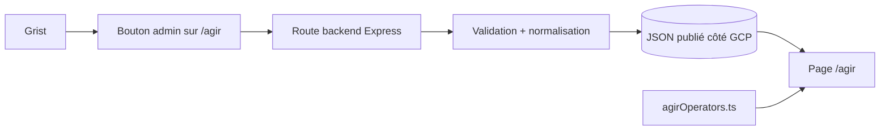
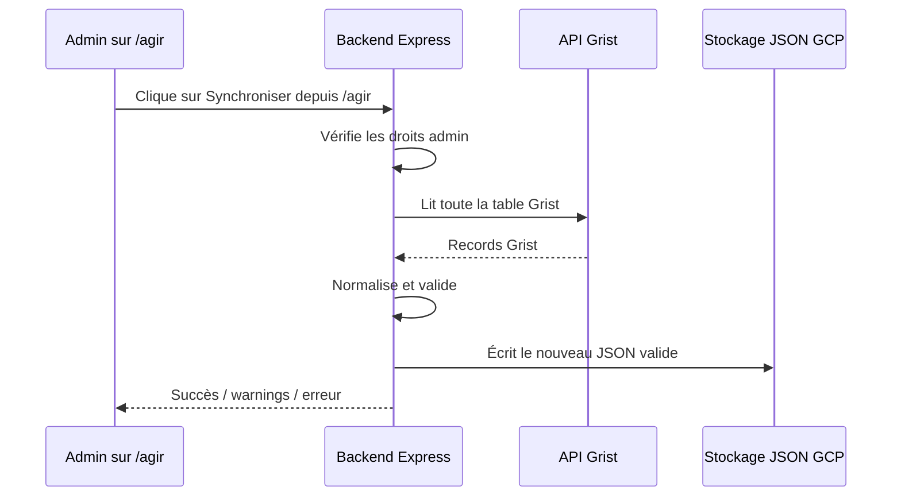
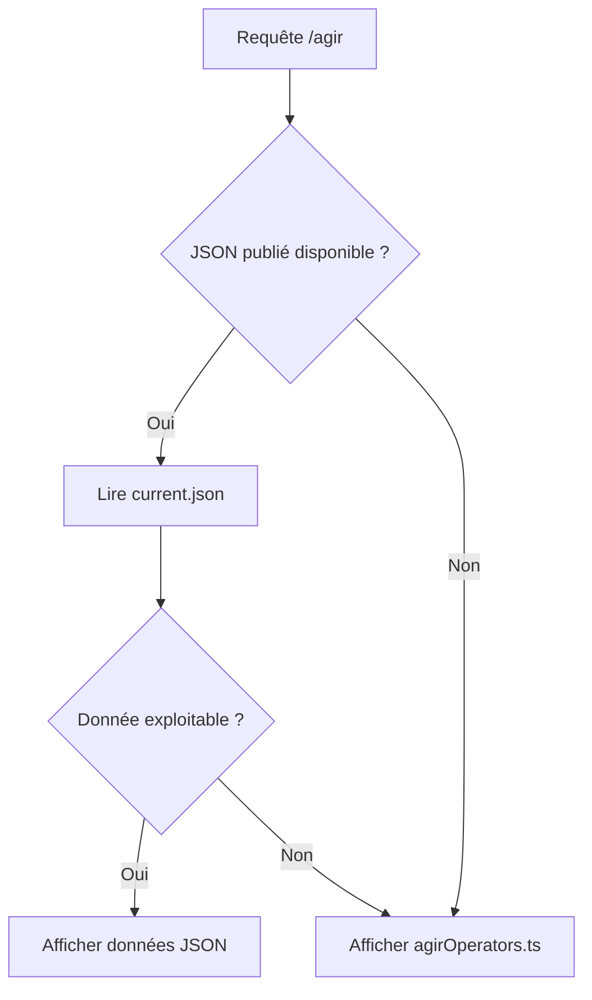
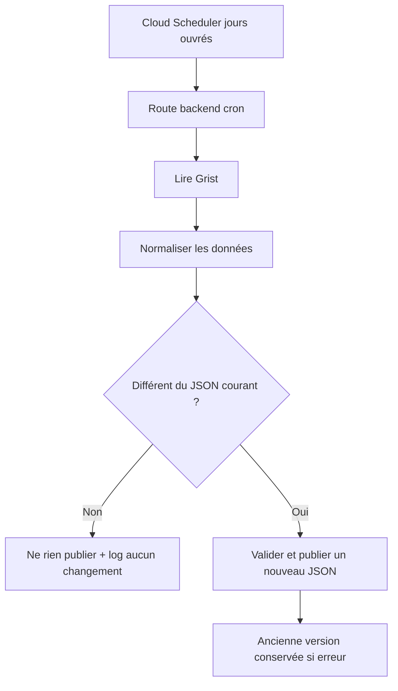
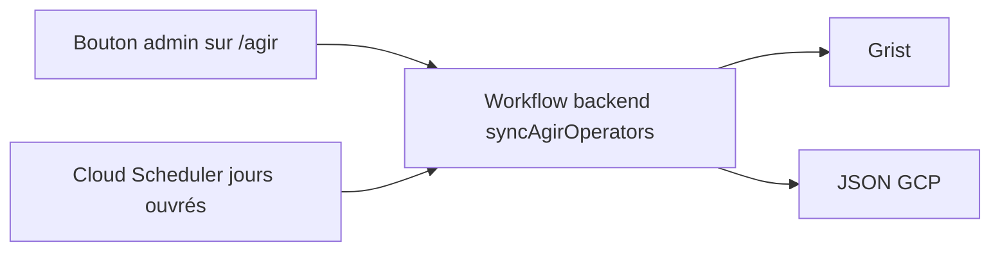

# Plan technique — données AGIR depuis Grist

## 1. Objectif

Remplacer la source principale actuelle :

```txt
apps/client/src/data/agirOperators.ts
```

par une donnée publiée depuis Grist, sans fragiliser la page publique `/agir`.

Le fichier statique actuel reste le fallback ultime.

## 2. Architecture cible



Principes :

- la synchronisation est déclenchée manuellement depuis `/agir` ;
- le bouton est visible uniquement pour les admins connectés ;
- la route de synchronisation est portée par le backend Express ;
- la route vérifie les droits admin côté serveur ;
- Grist n’est jamais appelé pendant la navigation des visiteurs ;
- si la synchronisation échoue, le JSON précédent reste en place ;
- si le JSON publié est indisponible, `/agir` utilise le fichier statique de secours.

## 3. Variables d’environnement prévues

```env
GRIST_API_URL=...
GRIST_API_KEY=...
AGIR_OPERATORS_GCS_BUCKET=...
AGIR_OPERATORS_GCS_OBJECT=...
AGIR_OPERATORS_PUBLIC_URL=...
```

À noter : le nom exact du bucket et le mode de lecture du JSON restent à valider. Voir [Bucket GCP — TBD](#8-bucket-gcp--tbd).

## 4. Données Grist utilisées

La table Grist contient actuellement environ 94 lignes, avec un département par ligne.

Champs retenus pour le premier lot :

| Colonne Grist | Usage | Statut |
|---|---|---|
| `Departement` | clé département + libellé | obligatoire |
| `Operateur` | nom affiché | obligatoire |
| `Mail_generique` | email affiché | optionnel |
| `Telephone` | téléphone affiché | optionnel |
| `Fiche_RI` | bouton “Découvrir la fiche” | optionnel |

Champs non utilisés pour ce premier lot :

- adresses ;
- région ;
- année ;
- mail secondaire.

## 5. Synchronisation — lot 1

La logique de synchronisation vit côté backend Express, même si le déclenchement manuel est affiché sur `/agir`.

Ce choix prépare le lot 2 : une synchronisation automatique pourra appeler le même workflow backend sans dupliquer la logique côté Next.

Route proposée côté backend :

```txt
POST /agir/operators/sync
```

Flux :



Réponse de succès :

```json
{
  "success": true,
  "source": "grist",
  "recordCount": 94,
  "departmentCount": 94,
  "syncedAt": "2026-06-24T...",
  "warnings": []
}
```

Réponse d’erreur :

```json
{
  "success": false,
  "error": "invalid_schema",
  "message": "Duplicate department 01",
  "previousVersionPreserved": true
}
```

## 6. Format JSON cible

Objet courant envisagé :

```txt
agir/operators/current.json
```

Format proposé :

```json
{
  "meta": {
    "source": "grist",
    "recordCount": 94,
    "departmentCount": 94,
    "syncedAt": "2026-06-24T...",
    "warnings": []
  },
  "operatorsPerDepartment": {
    "01": {
      "department": "01 - Ain",
      "operator": "Alfa3a",
      "email": "agir01@alfa3a.org",
      "phone": "07 48 13 40 00",
      "dispositifId": "660d1f34de63124662360640"
    }
  }
}
```

Règle importante : écrire `current.json` uniquement après validation complète. Si la validation échoue, l’objet courant n’est pas remplacé.

## 7. Validation et normalisation

Normalisations prévues :

- `trim()` sur les chaînes ;
- extraction du code depuis `Departement` ;
- extraction d’un ObjectId depuis `Fiche_RI` ;
- validation de l’email après nettoyage.

Erreurs critiques :

- Grist indisponible ;
- erreur HTTP ;
- JSON invalide ;
- `records` absent ou non-array ;
- département absent ou mal formé ;
- doublon de département ;
- opérateur vide ;
- aucune ligne valide.

Erreurs non critiques :

- email invalide : champ ignoré ;
- lien fiche RI invalide : bouton non affiché ;
- téléphone vide : champ non affiché.

## 8. Bucket GCP — TBD

Le bucket exact reste à confirmer avant implémentation.

### Ce qui existe déjà dans le repo

Le frontend référence déjà un bucket public d’assets :

```txt
https://storage.googleapis.com/refugies-info-assets/
```

Références repérées :

- `apps/client/src/assets/assetsOnServer.ts`
- `apps/client/next.config.js`
- `documentation/client/general.md`
- `documentation/client/architecture.md`

Ce bucket sert actuellement aux assets statiques frontend : images, pictogrammes, badges store, etc.

### Option A — réutiliser `refugies-info-assets`

Chemin possible :

```txt
gs://refugies-info-assets/agir/operators/current.json
https://storage.googleapis.com/refugies-info-assets/agir/operators/current.json
```

Avantages :

- bucket déjà connu du frontend ;
- lecture publique probablement déjà adaptée ;
- mise en place plus rapide.

Points à vérifier :

- le service qui synchronise a-t-il le droit d’écrire dans ce bucket ?
- l’équipe est-elle OK pour stocker une donnée JSON publique dans le bucket d’assets ?
- faut-il ajouter une archive horodatée sous `agir/operators/history/` ?

### Option B — créer un bucket dédié

Exemple :

```txt
refugies-info-public-data
```

Avantages :

- séparation claire entre assets statiques et données publiques générées ;
- droits IAM plus propres ;
- plus lisible à long terme.

Inconvénient :

- demande une petite configuration GCP supplémentaire.

### Décision à prendre

À date, la piste pragmatique est :

```txt
TBD — explorer la réutilisation de refugies-info-assets avec un préfixe agir/operators/
```

Mais la décision finale dépend des droits GCP et de la préférence équipe.

## 9. Lecture côté `/agir`



Lecture possible :

- via URL publique si l’objet est public ;
- via route serveur si l’objet reste privé.

Pour ce volume et cette donnée publique, une URL publique contrôlée est probablement l’option la plus simple.

## 10. Encart admin sur `/agir`

La page `/agir` affiche un encart réservé aux admins connectés.

Exemple :

```txt
Administration AGIR
Dernière synchronisation : 24/06/2026 à 15:42
94 opérateurs publiés
[ Synchroniser depuis Grist ]
```

L’encart doit afficher :

- un état de chargement ;
- un message de succès ;
- les warnings éventuels ;
- une erreur compréhensible en cas d’échec.

## 11. Lot 2 — synchronisation automatique jours ouvrés

Le lot 2 pourra ajouter un filet de sécurité automatique, en complément du bouton manuel.

Objectif : rattraper un oubli de synchronisation, pas remplacer le contrôle manuel.

Décisions prévues :

- fréquence : jours ouvrés uniquement ;
- publication : seulement si les données normalisées ont changé ;
- déclencheur : Cloud Scheduler ;
- cible : route backend protégée par le mécanisme cron existant ;
- workflow : le même que le bouton manuel.



Architecture cible à terme :



Point d’attention : la route cron doit être protégée côté backend et ne doit pas être callable publiquement sans secret.

## 12. Observabilité

Premier lot :

- logs structurés ;
- réponse JSON explicite à l’admin ;
- ancien JSON conservé en cas d’échec ;
- fallback statique si le JSON publié est inaccessible.

Slack est reporté.

Exemples de logs :

```txt
[agirOperators] sync succeeded
[agirOperators] sync failed, previous JSON preserved
[agirOperators] GCP JSON read failed, static fallback used
```

## 13. Points à valider avant implémentation

1. Position exacte de l’encart admin sur `/agir`.
2. Bucket à utiliser : `refugies-info-assets` ou bucket dédié.
3. Chemin final de l’objet JSON.
4. Objet public en lecture ou lecture via route serveur.
5. Versioning bucket ou archive horodatée explicite.
6. Afficher ou non une mention publique “Coordonnées mises à jour le …”.
7. Dépendance/lib à utiliser pour écrire le JSON côté GCP.
8. Pour le lot 2 : configuration Cloud Scheduler et route cron backend.
