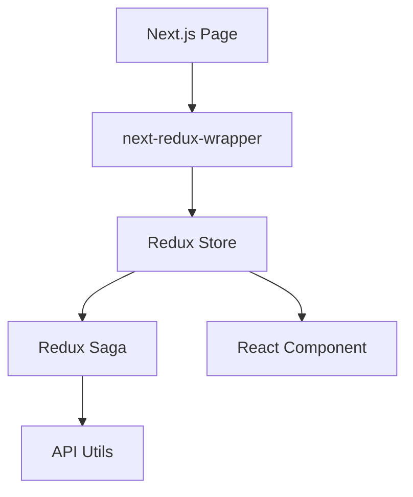
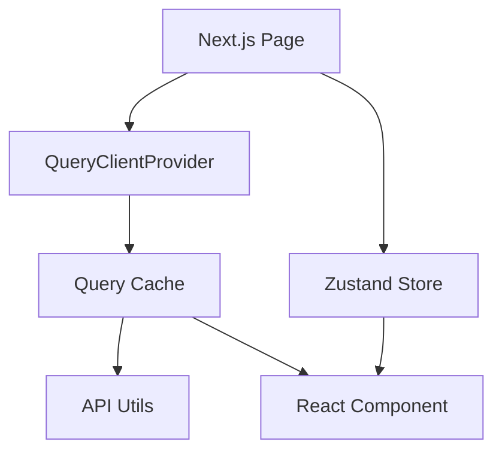

# Redux to TanStack Query + Zustand Migration Plan

## 1. Executive Summary

Moving from Redux/Sagas to TanStack Query (React Query) and Zustand offers significant benefits for the Karfur codebase:
- **~60-70% Code Reduction**: Deleting reducers, action types, action creators, and sagas.
- **Improved Performance**: Automatic caching, deduplication of requests, and background re-fetching.
- **Better UX**: Native loading/error states, optimistic updates, and no "stale" data issues.
- **Simpler SSR**: Standard Next.js patterns instead of `next-redux-wrapper` complexity.

## 2. State Analysis & Categorization

We have identified 22 reducers. Here is where they will move:

### 🌍 Server State (Move to TanStack Query)
*Data that originates from the API and should be cached.*
- `ActiveDispositifs`, `AllDispositifs`, `SelectedDispositif`
- `ActiveStructures`, `AllStructures`, `SelectedStructure`
- `ActiveUsers`, `AllUsers`, `User` (Current User profile)
- `Needs`, `Themes`, `Widgets`
- `UserContributions`, `UserFavorites`, `UserStructure`
- `SearchResults` (The `results` part)
- `SearchCounts`

### 🖥️ Client/UI State (Move to Zustand)
*Transient interface state, modals, and user preferences.*
- `Tts` (Text-to-Speech active state, spinner)
- `Miscellaneous` (Newsletter modal, global UI flags)
- `Langue` (Interface language selection - *could also be Context*)
- `SearchResults` (The `query` part - filters. **Recommendation**: Sync with URL query params + Zustand)

### 💀 To Be Deleted (Obsolete)
- `LoadingStatus`: React Query exposes `isLoading` / `isError` natively. No need to track this manually.
- `DispositifsWithTranslationsStatus`: Likely derived from normal Dispositif queries.

## 3. Architecture Changes

### Current Architecture


### New Architecture


## 4. Migration Strategy

We will adopt an **Incremental Strangler Fig Strategy**. Both systems will coexist until migration is complete.

### Phase 1: Foundation (Week 1)
1. Install `@tanstack/react-query` and `zustand`.
2. Wrap `_app.tsx` with `QueryClientProvider`.
3. Configure `HydrationBoundary` for SSR support.
4. Create the `useStore` hook for Zustand.

### Phase 2: Simple UI Conversion (Week 1-2)
TARGET: `Tts`, `Miscellaneous`
1. Create `useTtsStore` and `useUIStore`.
2. Replace `useDispatch` calls for these slices with store actions.
3. Replace `useSelector` calls with store hooks.
4. Delete corresponding Reducers/Sagas.

### Phase 3: Data Fetching Conversion (Week 2-4)
TARGET: `Themes`, `Needs`, `User` (High impact, simpler logic)
1. Create custom hooks: `useThemes`, `useNeeds`.
2. Implement `prefetchQuery` in `getStaticProps`.
3. Replace components to use `const { data } = useThemes()`.
4. Remove Redux hydration logic for these slices.

### Phase 4: Complex Features (Week 5-6)
TARGET: `SearchResults`, `Dispositif` (Complex logic)
1. Refactor Search Filters to URL/Zustand.
2. Move Search API calls to `useQuery` with enabled/dependency flags.
3. Handle complex side-effects (e.g., auto-opening modals) using `useEffect` or `onSuccess` callbacks (deprecated in v5 but replaced by useEffect).

### Phase 5: Cleanup (Week 7)
1. Remove `next-redux-wrapper`.
2. Remove `redux`, `redux-saga`, `react-redux`.
3. Remove `rootReducer` and `configureStore`.

## 5. Implementation Guide

### A. Installing Dependencies

```bash
npm install @tanstack/react-query zustand
npm install -D @tanstack/react-query-devtools
```

### B. Setting up Providers (`_app.tsx`)

```tsx
// apps/client/src/pages/_app.tsx
import { QueryClient, QueryClientProvider, HydrationBoundary } from '@tanstack/react-query';
import { useState } from 'react';

function MyApp({ Component, pageProps }: AppProps) {
  const [queryClient] = useState(() => new QueryClient({
    defaultOptions: {
      queries: {
        staleTime: 60 * 1000, // 1 minute default
      },
    },
  }));

  return (
    <QueryClientProvider client={queryClient}>
      <HydrationBoundary state={pageProps.dehydratedState}>
        {/* Existing Redux Provider can wrap this or be inside */}
        <Component {...pageProps} />
      </HydrationBoundary>
    </QueryClientProvider>
  );
}
```

### C. Replacing a Redux Slice (Example: Themes)

**Current Redux Saga Pattern:**
```typescript
// themes.saga.ts
export function* fetchThemes() {
  yield put(startLoading(...));
  const data = yield call(API.getThemes);
  yield put(setThemes(data));
}
```

**New React Query Pattern:**
```typescript
// hooks/useThemes.ts
import { useQuery } from '@tanstack/react-query';
import API from '~/utils/API';

export const useThemes = () => {
  return useQuery({
    queryKey: ['themes'],
    queryFn: () => API.getThemes(),
    staleTime: Infinity, // Themes rarely change
  });
};
```

**Usage in Component:**
```tsx
const { data: themes, isLoading } = useThemes();

if (isLoading) return <Spinner />;
return <ThemeList themes={themes} />;
```

### D. Replacing UI State (Example: TTS)

**New Zustand Store:**
```typescript
// stores/useTtsStore.ts
import { create } from 'zustand';

interface TtsState {
  isActive: boolean;
  showSpinner: boolean;
  toggle: () => void;
  setSpinner: (show: boolean) => void;
}

export const useTtsStore = create<TtsState>((set) => ({
  isActive: false,
  showSpinner: false,
  toggle: () => set((state) => ({ isActive: !state.isActive })),
  setSpinner: (show) => set({ showSpinner: show }),
}));
```

### E. Handling SSR/SSG (`getStaticProps`)

**Current `next-redux-wrapper`:**
```typescript
export const getStaticProps = wrapper.getStaticProps(store => async () => {
  store.dispatch(fetchThemes());
  await store.sagaTask.toPromise();
  return { props: {} };
});
```

**New Dehydration Pattern:**
```typescript
import { QueryClient, dehydrate } from '@tanstack/react-query';
import API from '~/utils/API';

export const getStaticProps = async () => {
  const queryClient = new QueryClient();

  await queryClient.prefetchQuery({
    queryKey: ['themes'],
    queryFn: API.getThemes,
  });

  return {
    props: {
      dehydratedState: dehydrate(queryClient),
    },
    revalidate: 60 * 10,
  };
};
```

## 6. Risks & Mitigation

| Risk | Impact | Mitigation |
|------|--------|------------|
| **Hydration Mismatches** | UI flicker or errors | Use `HydrationBoundary` correctly. Ensure server/client logic matches. |
| **Complex Sagas** | Loss of business logic | Carefully audit Sagas. Move logic to API utils or `useEffect`. |
| **Selectors** | Refactoring hell | Keep Selectors temporarily! You can write a selector that reads from React Query cache if needed, or just rewrite components one by one. |
| **Testing** | Tests failing | React Query needs a mock wrapper for tests. Update `render` utils. |

## 7. Next Steps

1. **Approval**: Confirm this plan.
2. **Setup**: I can install the libraries and set up `_app.tsx`.
3. **Pilot**: Migrate `Themes` (easiest data) and `Tts` (easiest UI) to prove the pattern.
