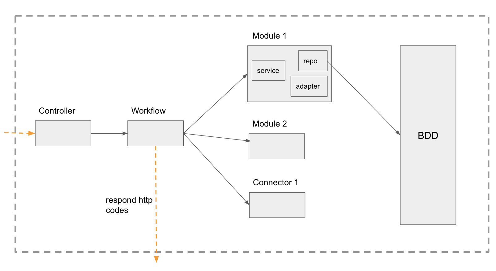

# Architecture

- [`controllers`](#controllers)
- [`workflows`](#workflows)
- [`modules`](#modules)
- [`libs`](#libs)
- [`schemas`](#schemas)
- [`connectors`](#connectors)

## `controllers`

### Responsibility

A controller is where we declare the routes for every business entity (user, dispositif, structure etc)

### Collaborators

- import only **workflows**

## `workflows`

### Responsibility

A workflow is where the logic of a route is orchestrated

### Collaborators

- Import **modules**, **connectors** or **libs**
- **Controllers** will import workflows

### Checks

- ✅ Fully unit tested
- ✅ Throw http code for the client

## `modules`

### Responsibility

A module is a business autonomous brick responsible for handling a business mission.
We want to have each module independant from other modules.

### Collaborators

- Import only **connectors**
- **Workflows** will import modules to perform business logic

### Checks

#### Everywhere in module folder

- ✅ Does **not** import other **modules**
- ✅ Fully unit tested
- ✅ Throw Business intellegible error messages

#### Repository

"repositories" are interfaces used to retrieve or modify business object from database

- ✅ Import only **schema**

#### Adapter

In software engineering, the adapter pattern is a software design pattern that allows the interface of an existing class to be used as another interface

- ✅ Should never be async
- ✅ Should have exact type

#### Index

In this project, module index are location for module related business function

- ✅ Every function should be used on workflow only

## `libs`

### Responsibility

A lib is a singleton with the intelligence to do non business related stuff. For example, libs do authorization checks.

### Collaborators

- any file can import `libs/\*``

### Checks

- ✅ Can be used by any other project without modification
- ✅ Fully tested

## `schemas`

### Responsibility

Schema are use to declare mongodb collections. There is one schema per collection.

### Checks

- ✅ Fully typed

## `connectors`

### Responsibility

A connector is the link between the app and a technical provider like Sendgrid

### Collaborators

- **Modules** and **Worflows** can import connectors to contact external services.

### Checks

- ✅ No business logic
- ✅ Functions are typed
- ✅ Fully unit tested
